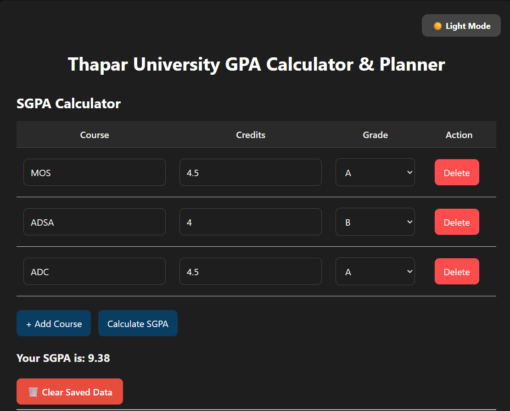
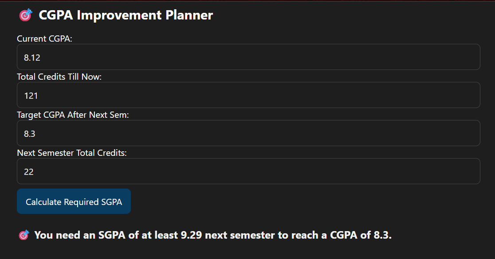

# 🎓 GPA Calculator & Planner – Thapar University

A modern, responsive web app to calculate **SGPA**, **CGPA**, and **plan GPA improvement** for Thapar University students. Built using **HTML, CSS, and JavaScript**, with support for **dark mode** and **local data saving**.

> 📍 Designed for students at **Thapar University** (but useful for all!).

---

## 🚀 Features

- 🎯 **SGPA Calculator**  
  Add subjects, grades, and credits to compute semester GPA in real-time.

- 📚 **CGPA Calculator**  
  Combine past CGPA and current semester results to get updated CGPA.

- 📈 **CGPA Improvement Planner**  
  Enter your target CGPA and get the SGPA required next semester to reach it.

- 🧮 **SGPA Impact Planner**  
  Enter expected SGPA and see what your CGPA will be after next semester.

- 🌗 **Dark Mode Toggle**  
  Switch between light/dark mode easily.

- 💾 **Auto Save in Browser**  
  Inputs are saved in `localStorage` so you don’t lose progress on reload.

---

## 📸 Preview

### 📌 SGPA & CGPA Calculator

### 📈 CGPA Planner

---

## 🖥️ Tech Stack

- HTML5
- CSS3 (Responsive Design + Dark Mode)
- JavaScript (Vanilla)

---

## 📡 Live Demo

[🌐 Click here to try it out](https://cgpa-buddy.netlify.app/)

---

## 🧠 How to Use

1. Enter your course names, credits, and grades → Click **"Calculate SGPA"**.
2. Input current CGPA and total previous credits → Click **"Calculate CGPA"**.
3. Try the **Planner tools** to:
   - See what SGPA is required to hit a target CGPA.
   - See the updated CGPA based on your next semester's expected SGPA.

---

## 🧑‍💻 Author

👨‍🎓 Jatin Chhabra

- 🔗 [LinkedIn](https://www.linkedin.com/in/106-jatinchhabra/)
- 📬 [Email](mailto:jatinchhabra.tech@gmail.com)

---

## 🧾 License

This project is licensed under the MIT License.

You are free to use, modify, and distribute this code, but please provide proper credit by linking back to this repository or mentioning the original author.

© 2025 Jatin Chhabra
